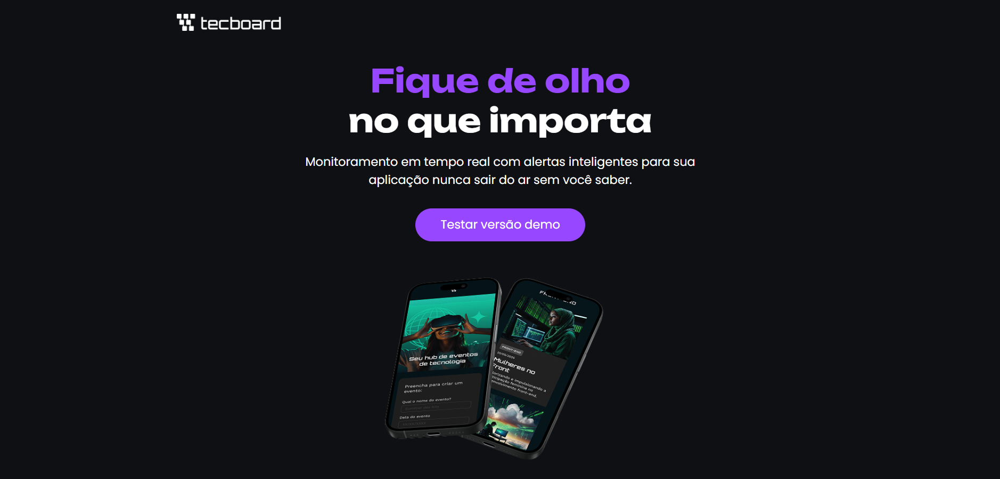

## 💻 Tecboard

* O Tecboard é uma landing page desenvolvida como parte da formação de Front-end da Alura. O objetivo principal deste projeto foi aplicar conceitos fundamentais de estruturação de páginas web e estilização moderna, focando na semântica e na organização do código.

## 📸 Visualização

<div align="center">

</div>

## 🔨 Funcionalidades

* **Estrutura Semântica**: Uso correto de tags HTML5 (header, main, footer, section) para acessibilidade e SEO.

* **Layout Responsivo**: Ajustes visuais para diferentes tamanhos de tela.

* **Estilização CSS**: Uso de classes para reaproveitamento de estilos e organização visual.

* **Identidade Visual**: Aplicação de paleta de cores e tipografia consistentes.

## 🛠️ Tecnologias Utilizadas

* **HTML5**: Estruturação do conteúdo.

* **CSS3**: Estilização e layout (Box Model, Flexbox).

* **Git/GitHub**: Versionamento de código.

## 📂 Estrutura de Arquivos
```

techboard/
├── css/
│   └── style.css      # Estilos principais do projeto
├── img/               # Imagens e ícones utilizados
├── index.html         # Arquivo principal
└── README.md          # Documentação do projeto

```

## 🚀 Como executar o projeto

**1.** Clone este repositório:
```
git clone [https://github.com/lucasbernardes26/tecboard.git](https://github.com/lucasbernardes26/tecboard.git)
```

**2.** Navegue até a pasta do projeto.

**3.** Abra o arquivo index.html no seu navegador favorito.

## ✒️ Autor

* *Lucas Bernardes*

⭐️ Se você curtiu esse projeto, não esqueça de dar uma estrela no repositório!
